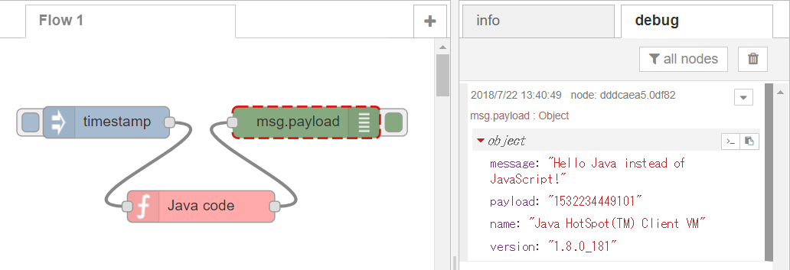
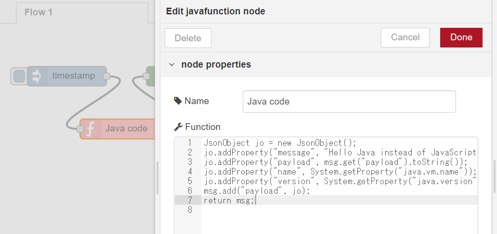
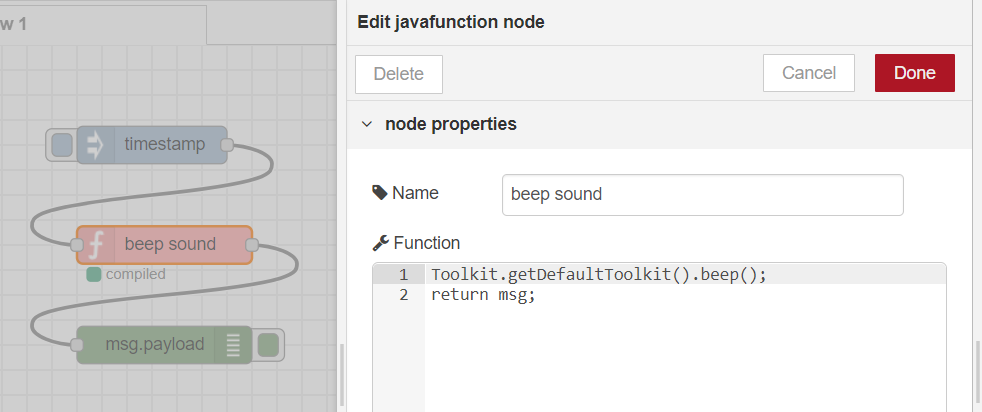
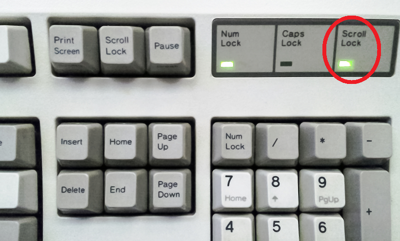
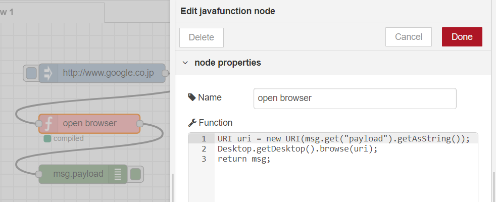
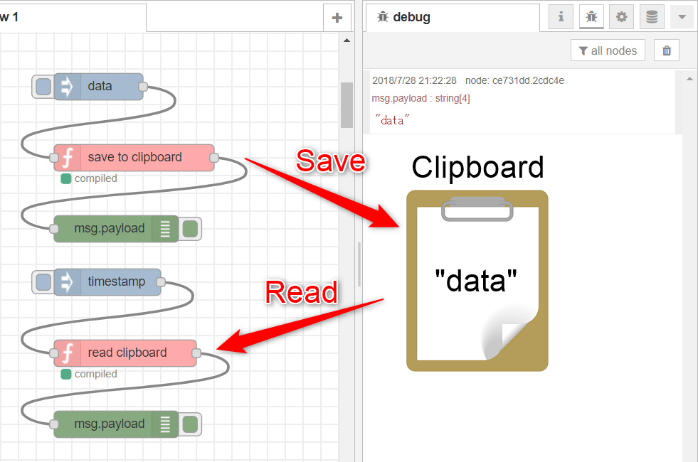
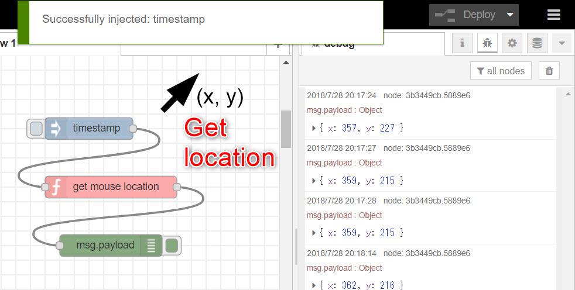
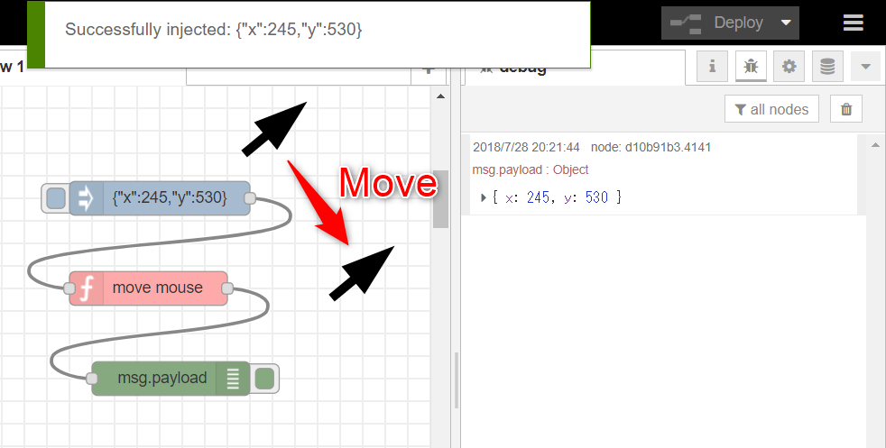
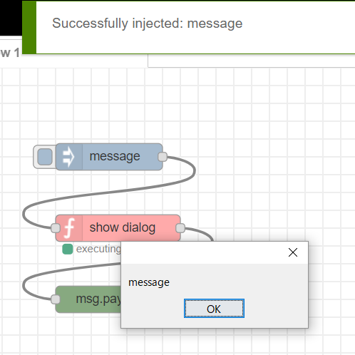

# node-red-contrib-java-function
--------------------------------

Node-RED node to run Java code like function node

Using the node, Node-RED users can use Java language instead of JavaScript in function node.



## How to write Java code in the Java function node

In the Java code of the node, msg will be received as Gson JsonObject.
Then, you can add Java code to handle the data.
Finally, the Java code needs to return JsonObject to send msg to the next node.



Because Gson library is used to handle JSON data in the node, the following user guide of Gson will be useful to write Java code in the node.

https://github.com/google/gson/blob/master/UserGuide.md

The Java function node supports Windows, macOS and Ubuntu.

## How to setup the Java environment

(1) Download and install Java Development Kit

http://www.oracle.com/technetwork/java/javase/downloads/jdk10-downloads-4416644.html

(2) Set environment variables, JAVA_HOME and PATH to enable java and javac command

http://www.baeldung.com/java-home-on-windows-7-8-10-mac-os-x-linux

## Sample flows
### (1) Beep sound from speaker
```
[{"id":"7668777e.580ae8","type":"inject","z":"3cd542b9.3985de","name":"","topic":"","payload":"","payloadType":"date","repeat":"","crontab":"","once":false,"onceDelay":"","x":160,"y":260,"wires":[["f5974570.d119d8"]]},{"id":"f5974570.d119d8","type":"javafunction","z":"3cd542b9.3985de","name":"beep sound","func":"Toolkit.getDefaultToolkit().beep();\nreturn msg;","outputs":1,"x":310,"y":260,"wires":[["279508d1.f18468"]]},{"id":"279508d1.f18468","type":"debug","z":"3cd542b9.3985de","name":"","active":true,"console":false,"complete":"false","x":470,"y":260,"wires":[]}]
```


### (2) Blink LED on the keyboard
```
[{"id":"44c7ddf6.403c24","type":"inject","z":"3cd542b9.3985de","name":"","topic":"","payload":"","payloadType":"date","repeat":"","crontab":"","once":false,"x":180,"y":480,"wires":[["e38dcfdf.cc86e"]]},{"id":"5a9065ca.2d930c","type":"debug","z":"3cd542b9.3985de","name":"","active":true,"console":false,"complete":"false","x":510,"y":480,"wires":[]},{"id":"e38dcfdf.cc86e","type":"javafunction","z":"3cd542b9.3985de","name":"blink scroll lock","func":"Robot rb = new Robot();\nrb.keyPress(KeyEvent.VK_SCROLL_LOCK);\nrb.keyRelease(KeyEvent.VK_SCROLL_LOCK);\nreturn msg;","outputs":1,"x":340,"y":480,"wires":[["5a9065ca.2d930c"]]}]
```
[](https://en.wikipedia.org/wiki/Scroll_lock)

### (3) Open the web page on the browser
```
[{"id":"b5368af2.afcbc8","type":"inject","z":"3cd542b9.3985de","name":"","topic":"","payload":"http://www.google.co.jp","payloadType":"str","repeat":"","crontab":"","once":false,"x":200,"y":380,"wires":[["272fb242.1067ee"]]},{"id":"272fb242.1067ee","type":"javafunction","z":"3cd542b9.3985de","name":"open browser","func":"URI uri = new URI(msg.get(\"payload\").getAsString());\nDesktop.getDesktop().browse(uri);\nreturn msg;","outputs":1,"x":400,"y":380,"wires":[["68407010.0f3ac"]]},{"id":"68407010.0f3ac","type":"debug","z":"3cd542b9.3985de","name":"","active":true,"console":false,"complete":"false","x":570,"y":380,"wires":[]}]
```



### (4) Write data to clipboard and read the data from clipboard
```
[{"id":"aee0f3ab.fadef","type":"inject","z":"3cd542b9.3985de","name":"","topic":"","payload":"data","payloadType":"str","repeat":"","crontab":"","once":false,"x":110,"y":360,"wires":[["8c33e48c.c2cac8"]]},{"id":"8c33e48c.c2cac8","type":"javafunction","z":"3cd542b9.3985de","name":"save to clipboard","func":"String str = msg.get(\"payload\").getAsString();\nToolkit tk = Toolkit.getDefaultToolkit();\nClipboard cb = tk.getSystemClipboard();\ncb.setContents(new StringSelection(str), null);\nreturn msg;","outputs":1,"x":270,"y":360,"wires":[["ce731dd.2cdc4e"]]},{"id":"ce731dd.2cdc4e","type":"debug","z":"3cd542b9.3985de","name":"","active":true,"console":false,"complete":"false","x":450,"y":360,"wires":[]},{"id":"51b942a1.110d0c","type":"inject","z":"3cd542b9.3985de","name":"","topic":"","payload":"","payloadType":"date","repeat":"","crontab":"","once":false,"x":120,"y":420,"wires":[["2e071160.2678ce"]]},{"id":"2e071160.2678ce","type":"javafunction","z":"3cd542b9.3985de","name":"read clipboard","func":"Toolkit tk = Toolkit.getDefaultToolkit();\nClipboard cb = tk.getSystemClipboard();\nObject oj = cb.getData(DataFlavor.stringFlavor);\nmsg.addProperty(\"payload\", oj.toString());\nreturn msg;","outputs":1,"x":280,"y":420,"wires":[["93c1a28a.e100a"]]},{"id":"93c1a28a.e100a","type":"debug","z":"3cd542b9.3985de","name":"","active":true,"console":false,"complete":"false","x":450,"y":420,"wires":[]}]
```


### (5) Get location of mouse cursor and move it.
```
[{"id":"84d59034.87a96","type":"inject","z":"3cd542b9.3985de","name":"","topic":"","payload":"","payloadType":"date","repeat":"","crontab":"","once":false,"x":120,"y":480,"wires":[["df3edce2.04cfa"]]},{"id":"df3edce2.04cfa","type":"javafunction","z":"3cd542b9.3985de","name":"get mouse location","func":"PointerInfo pi = MouseInfo.getPointerInfo();\nPoint pt = pi.getLocation();\nJsonObject jo = new JsonObject();\njo.addProperty(\"x\", pt.getX());\njo.addProperty(\"y\", pt.getY());\nmsg.add(\"payload\", jo);\nreturn msg;","outputs":1,"x":290,"y":480,"wires":[["3b3449cb.5889e6"]]},{"id":"3b3449cb.5889e6","type":"debug","z":"3cd542b9.3985de","name":"","active":true,"console":false,"complete":"false","x":470,"y":480,"wires":[]},{"id":"d80fd109.6c26f","type":"javafunction","z":"3cd542b9.3985de","name":"move mouse","func":"Robot rb = new Robot();\nJsonObject jo = (JsonObject)msg.get(\"payload\");\nint x = Integer.parseInt(jo.get(\"x\").toString());\nint y = Integer.parseInt(jo.get(\"y\").toString());\nrb.mouseMove(x, y);\nreturn msg;","outputs":1,"x":310,"y":540,"wires":[["d10b91b3.4141"]]},{"id":"888f6d50.e793f","type":"inject","z":"3cd542b9.3985de","name":"","topic":"","payload":"{\"x\":245,\"y\":530}","payloadType":"json","repeat":"","crontab":"","once":false,"x":140,"y":540,"wires":[["d80fd109.6c26f"]]},{"id":"d10b91b3.4141","type":"debug","z":"3cd542b9.3985de","name":"","active":true,"console":false,"complete":"false","x":470,"y":540,"wires":[]}]
```



### (6) Show dialog
```
[{"id":"80733fc8.a636b","type":"debug","z":"3cd542b9.3985de","name":"","active":true,"console":false,"complete":"false","x":490,"y":700,"wires":[]},{"id":"73578fbe.9ba63","type":"javafunction","z":"3cd542b9.3985de","name":"show dialog","func":"String lf = UIManager.getSystemLookAndFeelClassName();\nUIManager.setLookAndFeel(lf);\nString payload = msg.get(\"payload\").getAsString();\nJOptionPane op = new JOptionPane(payload,\n    JOptionPane.PLAIN_MESSAGE,\n    JOptionPane.DEFAULT_OPTION);\nJDialog dg = op.createDialog(null, null);\ndg.setAlwaysOnTop(true);\ndg.setVisible(true);\nreturn msg;","outputs":1,"x":330,"y":700,"wires":[["80733fc8.a636b"]]},{"id":"6467a0e7.53bfc","type":"inject","z":"3cd542b9.3985de","name":"","topic":"","payload":"message","payloadType":"str","repeat":"","crontab":"","once":false,"x":180,"y":700,"wires":[["73578fbe.9ba63"]]}]
```
